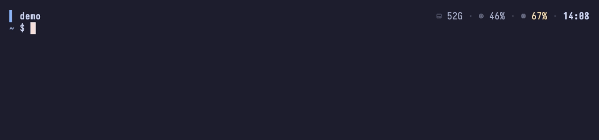
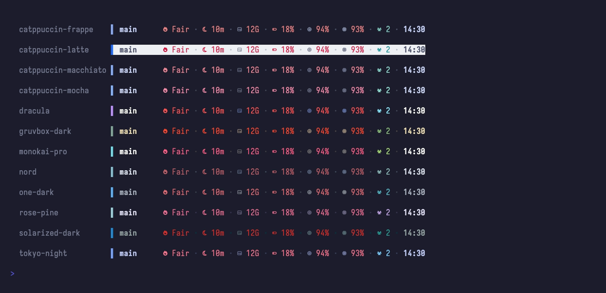
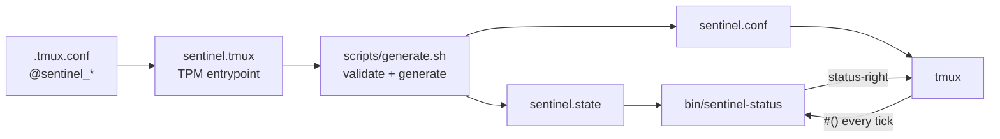

<div align="center">

# tmux-sentinel

**A quiet-by-default host health watchdog for your tmux status bar.**

Stays silent while your machine is healthy. Surfaces thermal throttling, sleep
risk, disk pressure, battery drain, memory pressure and CPU spikes the moment
they matter — each with a number attached.

[](https://github.com/nategriffin26/tmux-sentinel/actions/workflows/ci.yml)
[](LICENSE)
[](https://github.com/tmux/tmux)
[](#platform-support)



</div>

---

## Why

Most status bars are always shouting. A permanent CPU widget reading `4%` tells
you nothing, costs a fork every tick, and trains you to ignore the bar — so the
one time it reads `98%` you don't notice either.

tmux-sentinel inverts that. A healthy machine shows **free disk space, CPU,
memory and the clock**. Everything with a real alert condition stays hidden
until it crosses a threshold, so a segment appearing *is* the signal.

|                    | healthy                                  | something wrong                                            |
| ------------------ | ---------------------------------------- | ---------------------------------------------------------- |
| what you see       | disk · cpu · memory · clock              | throttling · sleep armed · disk low · battery draining · …  |
| segments rendered  | 4                                        | up to 8                                                     |

Which segments get that resting slot is entirely yours — `@sentinel_always`
controls it per segment, so you can put battery on the bar permanently, or
strip it back to just the clock.

It is also cheap enough to leave on. The whole bar is rendered by one native
binary that makes **zero child processes** per tick.

## Install

### tmux Plugin Manager (recommended)

```tmux
set -g @plugin 'nategriffin26/tmux-sentinel'
```

Press <kbd>prefix</kbd> + <kbd>I</kbd>. Then build the native engine once:

```sh
make -C ~/.tmux/plugins/tmux-sentinel
```

Without that step the plugin still runs, in a reduced POSIX-shell mode that
renders disk, CPU, memory and the clock. `sentinel doctor` will tell you which
mode is active.

### Manual

```sh
git clone https://github.com/nategriffin26/tmux-sentinel.git ~/.tmux/plugins/tmux-sentinel
make -C ~/.tmux/plugins/tmux-sentinel install
```

`make install` builds the engine, symlinks `sentinel` into `~/.local/bin`, and
adds one `source-file` line to your `~/.tmux.conf` (backing it up first).
`make uninstall` reverses exactly that.

## Configure

Configuration lives in ordinary tmux options, so your whole setup stays in
`.tmux.conf` and works with Nix, chezmoi, stow or a plain dotfiles repo.

```tmux
set -g @sentinel_theme          'tokyo-night'
set -g @sentinel_position       'bottom'
set -g @sentinel_glyphs         'ascii'      # no Nerd Font required
set -g @sentinel_disk_warn_gb   '50'
set -g @sentinel_segments       'disk,battery,cpu,memory,clock'
set -g @sentinel_always         'disk,battery,cpu,memory,clock'
```

`@sentinel_segments` decides which segments **exist**. `@sentinel_always`
decides which of them have a **resting state** rather than appearing only when
they have something to report.

<details>
<summary><strong>All options</strong></summary>

| Option | Default | Domain |
| --- | --- | --- |
| `@sentinel_theme` | `catppuccin-mocha` | any stem in [`themes/`](themes) |
| `@sentinel_position` | `top` | `top` · `bottom` |
| `@sentinel_interval` | `10` | integer 1–3600 (seconds) |
| `@sentinel_glyphs` | `nerd` | `nerd` · `unicode` · `ascii` |
| `@sentinel_always` | `disk,cpu,memory,clock` | comma list, no spaces |
| `@sentinel_segments` | all eight | comma list, no spaces |
| `@sentinel_windows` | `hidden` | `hidden` · `minimal` · `tabs` |
| `@sentinel_clock_format` | `%H:%M` | strftime, 1–32 chars |
| `@sentinel_session_max_length` | `18` | integer 1–64 |
| `@sentinel_accent` | *(glyph set default)* | 0–4 chars |
| `@sentinel_disk_warn_gb` | `25` | integer 0–100000 |
| `@sentinel_disk_crit_gb` | `15` | integer 0–100000 |
| `@sentinel_cpu_warn_pct` | `70` | integer 0–100 |
| `@sentinel_cpu_crit_pct` | `90` | integer 0–100 |
| `@sentinel_battery_warn_pct` | `50` | integer 0–100 |
| `@sentinel_battery_crit_pct` | `20` | integer 0–100 |
| `@sentinel_memory_warn_pct` | `80` | integer 0–100 |
| `@sentinel_memory_crit_pct` | `90` | integer 0–100 |

Every value is domain-validated before it reaches generated config. An
out-of-range value falls back to its default and says so via
`tmux display-message`. [`options.conf.default`](options.conf.default) documents
each one in full and doubles as the reference.

</details>

### Interactive customizer

```sh
sentinel
```

A curses UI that previews the real bar — the same bytes the engine emits — while
you cycle themes, glyph sets, segments and thresholds. Changes apply to the
running tmux server immediately and persist to
`~/.config/tmux-sentinel/options.conf`.

## Segments

| Segment | Alerts when | Resting state | Shows |
| --- | --- | --- | --- |
| **Thermal** | pressure above nominal | opt-in | `Fair` · `Serious` · `Critical` (Linux: `N°C`, alert at 80°C) |
| **Sleep risk** | idle sleep armed, nothing holding a wake assertion | opt-in | minutes until sleep — the thing that kills remote `mosh`/`ssh`/agent sessions |
| **Disk** | free space below `disk_warn_gb` | **default** | gigabytes free |
| **Battery** | discharging | opt-in | charge percent, icon and colour stepping down by threshold |
| **CPU** | above `cpu_warn_pct` | always | utilisation from real tick deltas, not load average |
| **Memory** | pressure above `memory_warn_pct`, or the kernel's own warning | always | memory pressure — the share of RAM unavailable, `100 - kern.memorystatus_level` (Linux: `MemAvailable`) |
| **Clients** | more than one attached | opt-in | client count |
| **Clock** | — | always | your `clock_format` |

"Resting state" is what the segment does when it has nothing to report:
**default** and **opt-in** are both just membership of `@sentinel_always`,
which you can change per segment. **always** means the segment has no quiet
state to suppress, so listing it is inert.

```sh
sentinel always battery     # give battery a permanent slot
sentinel always disk        # take disk's away again
```

## Themes

Twelve palettes, shown here in the alert state:



Adding one is a data file, not code — drop a `themes/<name>.palette` in and it
is immediately selectable. See [CONTRIBUTING.md](CONTRIBUTING.md#adding-a-theme).

## CLI

| Command | Does |
| --- | --- |
| `sentinel` | open the interactive customizer |
| `sentinel preview [-t THEME] [-g GLYPHS] [--sim healthy\|alert\|both]` | render the real bar in this terminal |
| `sentinel theme [NAME]` | list palettes with swatches, or apply one |
| `sentinel toggle SEGMENT` | enable or disable a segment |
| `sentinel always SEGMENT` | give a segment a resting state, or take it away |
| `sentinel set KEY VALUE` | change any setting, validated |
| `sentinel get [KEY]` | print current settings |
| `sentinel apply` | regenerate artifacts and reload tmux |
| `sentinel doctor [--fix]` | diagnose, and optionally repair, the install |
| `sentinel install` / `uninstall` | wire into / out of `~/.tmux.conf` |
| `sentinel completion bash\|zsh` | emit shell completions |

## Performance

The bar is rendered by a single C binary that talks to Mach, IOKit and
`statfs` directly. No `pmset`, no `df`, no `awk`, no subshells.

| | v0.1 (shell) | v0.2 (native) |
| --- | ---: | ---: |
| median per tick | 44.6 ms | **5.4 ms** |
| fastest observed | 40.3 ms | **4.6 ms** |
| child processes per tick | 21–28 | **0** |

Measured on an M3 Pro with an interleaved A/B so both implementations saw the
same system load, and stable across repeated runs. Reproduce it with
`make bench`, which recovers the v0.1 engine from git history and re-races it.
About 1.7 ms of the remaining time is process-spawn cost that any tmux `#()`
command pays, so the engine's own work is roughly 3.7 ms.

Concurrency is handled properly: CPU tick deltas live in a locked, timestamped
record in a validated per-user runtime directory, so N attached clients and a
preview running at the same time all read a consistent value instead of racing.

## Platform support

| | macOS | Linux |
| --- | --- | --- |
| CPU, memory, disk, clock, clients | ✅ | ✅ |
| Battery | ✅ IOKit | ✅ aggregates every `/sys/class/power_supply/*` battery |
| Thermal | ✅ thermal-pressure notifications | ✅ hottest CPU/package sensor |
| Sleep risk | ✅ IOPM assertions | ❌ not implemented |

## Architecture



Two rules keep it honest:

1. **The bar has exactly one renderer.** `bin/sentinel-status` produces every
   segment, and `sentinel preview` and the TUI display *its* output rather than
   reimplementing the layout. The predecessor had four implementations of one
   bar and they disagreed in eleven measurable ways.
2. **There is exactly one generator.** `scripts/generate.sh` is the only thing
   that writes tmux config, and the only place user input is validated. Nothing
   else may interpolate a user value into `sentinel.conf`.

No Python is required for the status bar to work; it powers only the CLI and
the customizer.

## Development

```sh
make            # build the engine
make test       # 65 tests: engine contract, injection, tmux validity, concurrency
make lint       # shellcheck every script
make bench      # the A/B in the table above
```

Tests use a private tmux socket and a scratch `XDG_CONFIG_HOME`, so they never
touch your session or your config.

[docs/CONTRACT.md](docs/CONTRACT.md) is the design contract: the state-file
grammar, the engine CLI, the segment rendering rules and the option domains.
Read it before adding a segment or an option.
[CONTRIBUTING.md](CONTRIBUTING.md) covers the day-to-day workflow.

```sh
sentinel doctor          # what is broken, and why
./assets/theme-grid.sh   # every bundled palette, side by side
```

## Credits

Palettes adapted from [Catppuccin](https://github.com/catppuccin),
[Tokyo Night](https://github.com/enkia/tokyo-night-vscode-theme),
[Nord](https://www.nordtheme.com), [Gruvbox](https://github.com/morhetz/gruvbox),
[Rosé Pine](https://rosepinetheme.com), [Dracula](https://draculatheme.com),
[Solarized](https://ethanschoonover.com/solarized),
[One Dark](https://github.com/atom/atom) and
[Monokai Pro](https://monokai.pro).

## License

MIT © [Nate Griffin](https://github.com/nategriffin26) — see [LICENSE](LICENSE).
